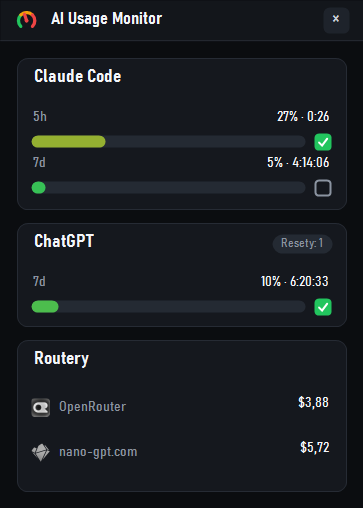
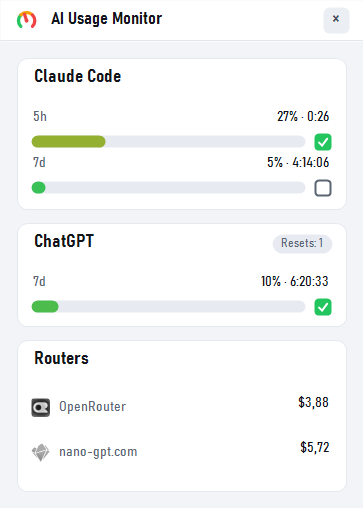

# AI Usage Monitor

A small portable Windows widget for monitoring **Claude Code** and **Codex** usage limits, plus prepaid balances on **OpenRouter** and **nano-gpt.com**. It lives in the system tray, can stay on top, and keeps its settings beside the EXE.

The current installer is always available in [GitHub Releases](https://github.com/jpribil/ai-usage/releases). The project targets Windows x64.

## Preview

<p align="center">
  
  
</p>

<p align="center"><em>Dark and light widget themes.</em></p>

## Features

- Shows Claude Code's five-hour and seven-day usage limits, including reset times.
- Shows Codex's seven-day limit and available reset credits, when provided by the account.
- Shows the remaining USD balance for OpenRouter and nano-gpt.com.
- Clicking a router balance opens its credits page; the cursor changes to a hand over the link.
- Refreshes automatically every 1, 5, 15, or 60 minutes, or on demand from the menu.
- Sends a one-time [ntfy.sh](https://ntfy.sh) notification when an armed limit resets. The checkbox is cleared only after successful delivery, and the channel dialog includes a test-send button.
- Supports Czech and English, dark/light themes, Windows startup, and always-on-top mode.
- Checks this private GitHub repository for newer releases.

## Data sources

The widget does not estimate usage or send it through a separate application server. It reads data directly from the signed-in account or the provider API on the user's computer.

| Service | What the widget displays | Source |
| --- | --- | --- |
| Claude Code | Five-hour and seven-day usage, reset time | The Claude Code login token from `%USERPROFILE%\\.claude\\.credentials.json`, or from a detected WSL distribution; queried through the Anthropic OAuth usage endpoint. The standard `%USERPROFILE%\\.local\\bin\\claude.exe` renews the login when needed. If the main response does not include limits, the app reads Anthropic API rate-limit response headers. |
| Codex | Short-window and weekly usage, reset time, available reset credits | The Codex login token from `%USERPROFILE%\\.codex\\auth.json` (or `CODEX_HOME\\auth.json`); queried through the ChatGPT/Codex account usage endpoint. |
| OpenRouter | Remaining prepaid USD | `GET /api/v1/credits`; the app calculates `total_credits − total_usage`. An OpenRouter **management API key** is required. |
| nano-gpt.com | Current USD balance | `POST /api/check-balance` with the `x-api-key` header. A nano-gpt.com API key is required. |

The OpenRouter balance opens [Credits settings](https://openrouter.ai/settings/credits); the nano-gpt.com balance opens the [balance page](https://nano-gpt.com/balance).

## Getting started

1. Download `AIUsageMonitor.exe` from [Releases](https://github.com/jpribil/ai-usage/releases) into a folder of your choice.
2. Install the **.NET 8 Windows Desktop Runtime (x64)**. The EXE is intentionally framework-dependent to keep it small.
3. Start the application. Claude Code and Codex work when their respective CLIs are signed in.
4. Right-click the widget and select **Router API keys…** to enter an OpenRouter and/or nano-gpt.com key.

Right-click opens the full menu: manual refresh, refresh interval, appearance, language, notifications, Windows startup, update checks, and exit. Double-clicking the tray icon hides or shows the widget.

## Privacy and local files

- `settings.json` is created **next to the EXE**, never in AppData.
- Router API keys and the update-check token are encrypted with Windows DPAPI for the current user before being written to settings.
- Claude Code and Codex login tokens are read from their existing local files only; this application does not modify them.
- The diagnostic log is at `%TEMP%\\ai-usage-monitor.log`; startup failures are recorded separately in `%TEMP%\\ai-usage-monitor-startup-errors.log`.

For update checks against the private repository, configure a GitHub token with read-only access to that repository's contents and releases.

## Development and releases

```powershell
dotnet build .\src\AIUsageMonitor\AIUsageMonitor.csproj -c Release
.\tools\release.ps1 -Version '2.19'
```

The release script publishes the EXE to `publish\\win-x64`, stops only the previously running copy from that folder, starts the app after building, and creates a commit and tag. GitHub Actions attaches the EXE to the release.

This README is part of every release: it must be updated whenever functionality, data sources, permissions, or installation change.
